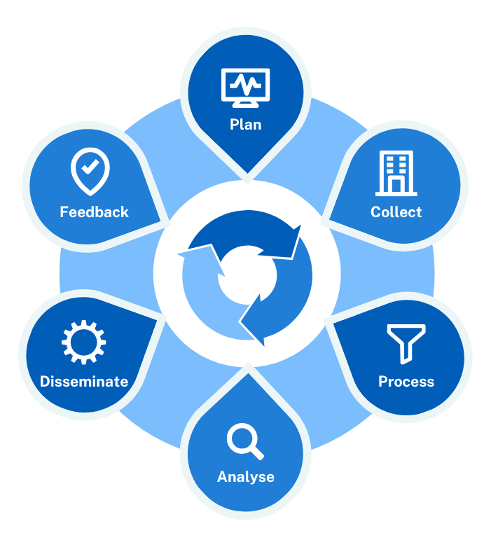

# Intelligence Cycle

## Overview
The intelligence cycle is a continuous, structured process for turning raw information into actionable intelligence that can assist stakeholders and decision makers at all levels of an organisation. It begins with identifying individual requirements, collecting and processing data, analysing it to produce intelligence, and disseminating it to stakeholders. The final feedback phase then helps adjust future efforts, ensuring improvement over time. It is used to inform decision making across multiple sectors, both public and private. 

The cycle is not always linear and often loops as new information is gathered.

{: style="height:546px;width:490px;display:block;margin:0 auto"}

## Intelligence Cycle Phases

### Planning / Direction
This stage defines what cyber threats need to be understood. It involves setting intelligence priorities based on business risks, threat landscapes, and stakeholder requirements. Clear objectives ensure that resources focus on relevant cyber threats like APTs, malware campaigns, or sector-specific risks that are related to the defined requirements. 

### Collection
Intel teams gather data from a variety of sources. Open-source feeds, dark web forums, internal logs, honeypots, trusted partners, sharing groups, etc. The goal is to capture tactics, techniques, and procedures (TTPs), threat actor motives, indicators of compromise (IOCs), and other threat related data.

### Processing
Raw data is normalised, enriched, filtered, and prioritised. The output is structured information that can be queried or analysed effectively in the next stage of the cycle. 

### Analysis
Analysts assess the processed data to identify threat actors, attack patterns, or vulnerabilities. They create threat reports, alerts, and risk assessments tailored to specific stakeholders, ranging from SOC teams to executive leadership.

### Dissemination
Finished intelligence products are shared in actionable formats like reports or briefings. It must be timely and aligned with the stakeholder audience it is intended for. 

### Feedback
Stakeholders provide input on the usefulness of the intelligence. This helps intel teams refine their collection methods, focus areas, and products, keeping the intelligence cycle adaptive and effective.

